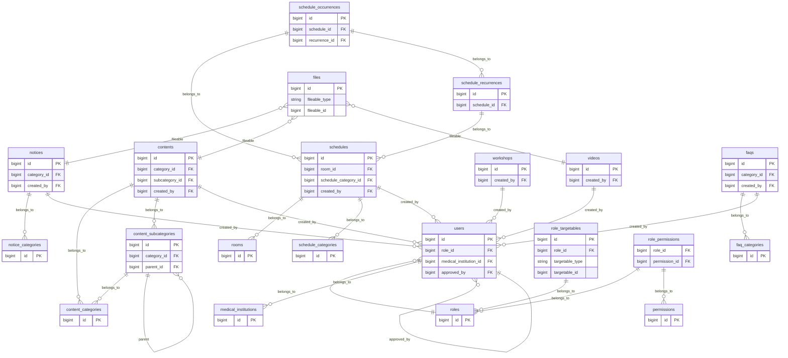
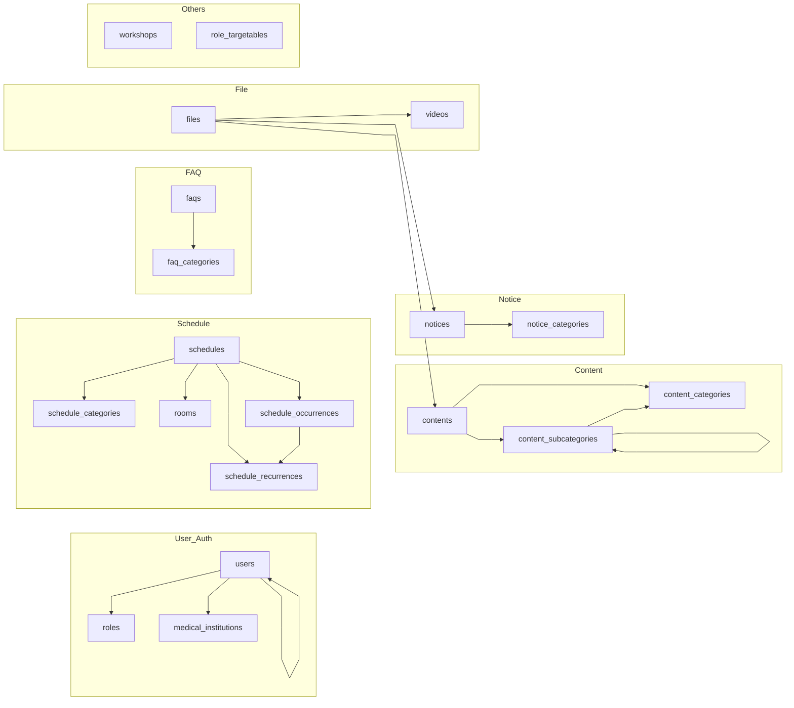

# 🩺医師会会員専用サイト

## プロジェクトの概要
このプロジェクトは、医師会会員向けの専用サイトです。</br>
Laravel（API）と Vue（SPA）を用いたフルスタック構成で、会員向け機能と管理者向け機能を備えています。

会員はログイン後に医師会からのお知らせ、研修会情報、会員情報の確認・変更などを行うことができ、
管理者は CMS 画面からリッチテキストを用いたお知らせ配信、会員管理、研修会管理、ロール設定などを行えます。

Tailwind CSS によるレスポンシブ対応、Railway へのデプロイ、MailpitやResendを用いたメール開発・運用環境など、実運用を想定した構成で開発しています。

## 本番環境（Railway）
https://member-portal-production-960b.up.railway.app

## 💡 こだわり・実装の工夫点

### 1. 動的なコンテンツ・スケジュール拡張構造
* **動的なカテゴリ＆メニュー連動（Contents）**
  管理者が管理画面からコンテンツカテゴリを追加・変更すると、会員用画面のナビゲーションやリンク構造が**自動的に拡張・追加**される構造になっています。コードを変更することなく柔軟なカテゴリ追加が可能です。
* **スケジュール機能の工夫（Google カレンダー風の繰り返し予定）**
  本システムのスケジュールは **Google カレンダーのような繰り返し予定に対応**しています。</br>
  ・ 毎週 / 毎月 / 第◯曜日などの繰り返し設定</br>
  ・recurrence（繰り返しルール）と occurrences（実際の発生）の分離</br>
  ・例外日（skip）や特定日の上書き（override）にも対応</br>
  ・管理者が会議室を追加すると、カレンダーの**表示エリアに自動反映**</br>

### 2. Tiptap エディタによるリッチテキスト編集
* お知らせや各種コンテンツの作成・編集には、モダンな WYSIWYG エディタ **Tiptap** を導入。直感的な装飾（太字・見出し・リスト・リンク埋め込みなど）に対応しています。

### 3. セキュリティと権限分離（RBAC）
* **システム管理者（system）ロールの独立**
  一般管理者とシステム管理者を分離。PermissionのCRUD、お知らせカテゴリ（Notice-category）の管理など「システム根幹の設定」のみを system ロールに閉じることで、誤操作やセキュリティリスクを最小化しています。
* **ロールターゲット機能**
  特定ロールの会員のみが閲覧できるお知らせやコンテンツの制御（権限別フィルタリング）を実装しています。


## 環境構築（Laravel Sail)
  1. リポジトリをクローンし、プロジェクトフォルダに移動
``` bash
git clone git@github.com:yun-0312/member-portal.git
cd member-portal
```
 2. Sailを起動
``` bash
./vendor/bin/sail up -d
```
初回は依存関係がないので以下を実行
``` bash
composer install
```
 3. 「.env」の設定
``` text
    # データベース設定(Sailのデフォルト)
     DB_CONNECTION=mysql
     DB_HOST=mysql
     DB_PORT=3306
     DB_DATABASE=laravel
     DB_USERNAME=sail
     DB_PASSWORD=password

    # MailPit設定(Sailのデフォルト)
    MAIL_MAILER=smtp
    MAIL_HOST=mailpit
    MAIL_PORT=1025
    MAIL_USERNAME=null
    MAIL_PASSWORD=null
    MAIL_ENCRYPTION=null
    MAIL_FROM_ADDRESS="hello@example.com"
    MAIL_FROM_NAME="${APP_NAME}"

```
 4. アプリケーションキー作成
``` bash
./vendor/bin/sail artisan key:generate
```
 5. マイグレーション、シーディング実行
``` bash
./vendor/bin/sail artisan migrate --seed
```
 6. ストレージリンクを作成
``` bash
./vendor/bin/sail artisan storage:link
```
## フロントエンド（Vue）
  1. Node コンテナに入る（Sail）
``` bash
./vendor/bin/sail npm install
```
 2. 開発サーバー起動
``` bash
./vendor/bin/sail npm run dev
```

## サンプルユーザーアカウント（動作確認用）
UsersTableSeederで登録されるメール認証済みのテストユーザーです。<br />
ユーザーによって見ることができるページが違います。

・ログインURL：http://localhost/

・会員ユーザー（一般会員）<br />
Email: member@example.com<br />
Password: password<br />
・医療機関スタッフユーザー<br />
Email: medical@example.com<br />
Password: password<br />
・理事ユーザー<br />
Email: director@example.com<br />
Password: password<br />
・管理者ユーザー<br />
Email: admin@example.com<br />
Password: password<br />
・医師会事務員ユーザー<br />
Email: staff@example.com<br />
Password: password<br />
・システム管理者ユーザー<br />
Email: system@example.com<br />
Password: password<br />

### ※システム管理者ユーザー（system）
システム管理者は、一般の管理者とは異なり、
システムの根幹に関わる設定のみを扱う特別ロールです。

・permission の CRUD<br />
・お知らせカテゴリ（Notice-category）の CRUD<br />
・コード変更が必要な設定項目の管理<br />
・その他の管理機能にはアクセス不可（安全性のため）<br />
<br />
RBAC の観点から、<br />
「一般管理者が触れるべきでない領域」を system ロールに分離することで、<br />
運用時の安全性と権限の明確化を実現しています。<br />


## 実装機能一覧
### 会員向け機能
・ログイン/ログアウト/パスワードリセット<br />
・医療機関スタッフによる新規会員登録申請（管理者承認制）<br />
・お知らせ一覧（カテゴリ別・権限別表示）<br />
・スケジュール一覧（動的カレンダー表示）<br />
・研修会一覧・動画一覧<br />
・各種書類・資料一覧（ファイルダウンロード）<br />
・問い合わせ報告一覧<br />

### メール機能・注意点
本番環境では Resend（メールAPI） を使用してメール送信を実装しています。<br />
・会員登録時のメール認証（Verify Email）<br />
・メールアドレス変更時のメール認証（Verify Email）<br />
・会員登録が承認された時の登録完了メール（Welcome）<br />
</br>
  ⚠️ 本番環境（Railway）でのメールテスト時の注意点<br />
  現在本番環境で利用している Resend アカウントは無料枠・開発用ドメイン制限が適用されているため、</br>
  テスト送信先アドレスが開発者（管理者）のメールアドレス宛てのみに制限されています。</br>

  そのため、新規登録やパスワードリマインダー等のメール実送信テストは、ローカル開発環境（MailPit: http://localhost:8025）
  にてご確認ください。</br>

### 管理者向け機能
・会員管理（検索・編集・承認）<br />
・医療機関管理（検索・編集・代表者設定）<br />
・コンテンツ投稿・編集（Tiptapエディタ対応）<br />
・ロール管理 / 権限設定（RBAC）<br />
・ロールターゲット機能（閲覧対象ロール制限）<br />

## 使用技術
      <br />
  ・Backend: PHP 8.3 / Laravel 10<br />
・Frontend: Vue 3 (Options/Composition API) / Tiptap / Tailwind CSS<br />
  ・Database: MySQL 8.0<br />
  ・Dev Environments: Docker (Laravel Sail) / MailPit<br />
  ・Production/API: Railway / Resend<br />

## テスト
バックエンド（PHPUnit）およびフロントエンド（Vitest）の単体・機能テストを構築しています。<br />
現在は主にログインや認証関係のテストに絞っています。今後、Feature / Unit テストを追加構築予定です。<br />

### バックエンドテスト (PHPUnit / Feature & Unit)
``` bash
./vendor/bin/sail artisan test
```
### フロントエンドテスト (Vitest / Vue 3)
``` bash
./vendor/bin/sail npm run test:vue
```
## ER図



- Userは医療機関に所属
- Contentはカテゴリ・サブカテゴリ構造
- ScheduleはRecurrenceとOccurrenceで分離
- Policyによりユーザーロール単位でアクセス制御

## URL
・会員画面：http://localhost/<br />
 ・phpMyAdmin：http://localhost:8080/<br />
・MailPit：http://localhost:8025<br />
・Railway本番環境：https://member-portal-production-960b.up.railway.app
